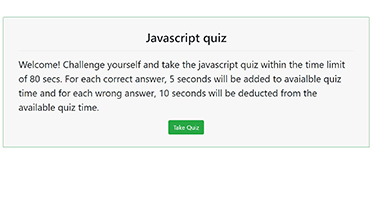

   

# Links to deployed application and repository:
* [Deployed Application](https://sskumar4.github.io/timedCodeQuiz)
* [Repository](https://github.com/sskumar4/timedCodeQuiz)

# Project Name: timedCodeQuiz
# Title: Javascript Code Quiz

# Introduction:
Javascript Quiz is a timed quiz app using JavaScript that stores scores. The quiz consists of multiple-choice questions with color change feature for right and wrong answer. The app will run in the browser and feature dynamically updated HTML and CSS powered by JavaScript code. It will also feature a clean and polished user interface and be responsive, ensuring that it adapts to multiple screen sizes.

# Technologies:
HTML, CSS, Javascript

# Features
Created the following files:
  * index.html, codeQuiz.html quizComplete.html, quizScore.html
js files:
  * codeQuiz.js, quizComplete.js, quizScores.js
css files
  * mainstyle.css

Developed the site with the following features:
  * User is presented with a start quiz button to begin the quiz
  * A timer starts with total 80 secs and immediately the user is presented with a question
  * When one question is answered, the user is presented with another question (Upto seven questions)
  * For each correct answer, 5 seconds will be added to avaialble quiz time and for each wrong answer, 10 seconds will be deducted from the available quiz time
  * A "Right" or "Wrong" message is displayed below the multiple choice questions when a user selects an answer
  * When the answer is correct, the word Right turns green
  * When the answer is incorrect, the word wrong turns red. Also 10 seconds is subtracted from the timer for each incorrect answer
  * The quiz ends When all questions are answered or the timer reaches 0
  * When the quiz is completed, the score is displayed and the user can save their initials
  * The user can start a new quiz by clicking "Go Back" button

Used HTML validation service to ensure that each page has valid HTML.

# Launch

Launch [Deployed Application](https://sskumar4.github.io/timedCodeQuiz/) to view the index. 
